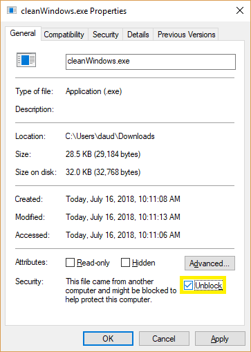

# cleanWindows
Remove unwanted default software from Microsoft Windows 10 Build 17134

`cleanWindows.exe [-verify]`

Specify -verify on command line to require confirmation for each removal operation.

# download

  * Download [cleanWindows-master.zip](https://github.com/dragondaud/cleanWindows/archive/master.zip)
  * Extract cleanWindows.exe then right-click and select Properties.
  * Check the 'unblock' box to allow execution, then double-click to run.

